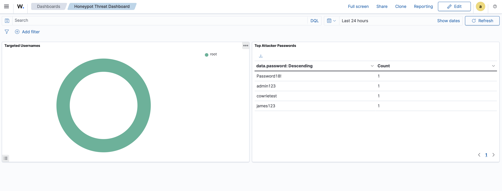

# SSH Honeypot & Attack Dashboard

### Phase 1: Architecture & Network Isolation
To safely observe attacker behavior, a lightweight Linux virtual machine was provisioned to host the deception technology. 

**Security Controls Implemented:**
* **Network Isolation:** The honeypot VM was deliberately configured using a NAT/Shared Network adapter rather than a Bridged connection. This ensures the vulnerable system is logically separated from the host's physical network, preventing potential lateral movement to personal devices in the event of a sandbox escape.
* **OS Hardening:** Deployed a minimal ARM64 server image, reducing the overall attack surface before deploying the honeypot application.

### Phase 2: Deploying Deception Technology
**Cowrie**, an interactive SSH and Telnet honeypot, was deployed to simulate a vulnerable Linux server. 

**Deployment Highlights:**
* **Least Privilege Execution:** Cowrie was installed and executed under a restricted, non-root user account to mitigate the risk of sandbox evasion and privilege escalation.
* **Isolated Environment:** The application was built within a Python virtual environment to ensure dependency isolation and system stability.
* **Service Verification:** Successfully tested the honeypot's deception capabilities by initiating an SSH connection from the host machine to the designated honeypot port (2222), confirming the simulated filesystem was active and logging keystrokes.

### Phase 3: SIEM Integration & Alerting
To transition from passive logging to active monitoring, the honeypot was integrated with the Wazuh SIEM to parse and index attacker activity in real time.

* **Log Ingestion:** Configured the Wazuh agent to ingest Cowrie's raw JSON logs, extracting critical telemetry including source IP, destination port, session IDs, and injected commands.
* **Custom Rule Detection:** Leveraged Wazuh decoders to map specific honeypot events, successfully capturing event IDs like `cowrie.login.success`[cite: 6]. The SIEM correctly extracted key authentication data, parsing `data.username` and `data.password` directly from the attacker's brute-force attempts[cite: 6]. 
* **Alert Triggering:** The system was validated when it generated Level 10 alerts triggering on the rule description: "Cowrie Honeypot: Attacker successfully logged in"[cite: 6].

### Phase 4: Threat Intelligence Dashboard
To provide high-level visibility into automated brute-force campaigns, a custom threat intelligence dashboard was engineered within the OpenSearch/Kibana interface.

* **Data Aggregation:** Filtered indexed alert data to isolate active SSH brute-force campaigns, splitting data rows by specific custom fields to aggregate metrics by `data.password: Descending`[cite: 7].
* **Visualization Configuration:** Built a donut chart mapping the `data.username` field to track primary targeted accounts (revealing 100% targeting of the `root` account)[cite: 8], alongside a descending data table cataloging the specific passwords (e.g., `Password18!`, `admin123`) utilized during the intrusion attempts[cite: 7].
* **Executive Reporting:** Consolidated these visualizations into a single "Honeypot Threat Dashboard" for immediate threat triage, metric tracking, and reporting[cite: 4].

